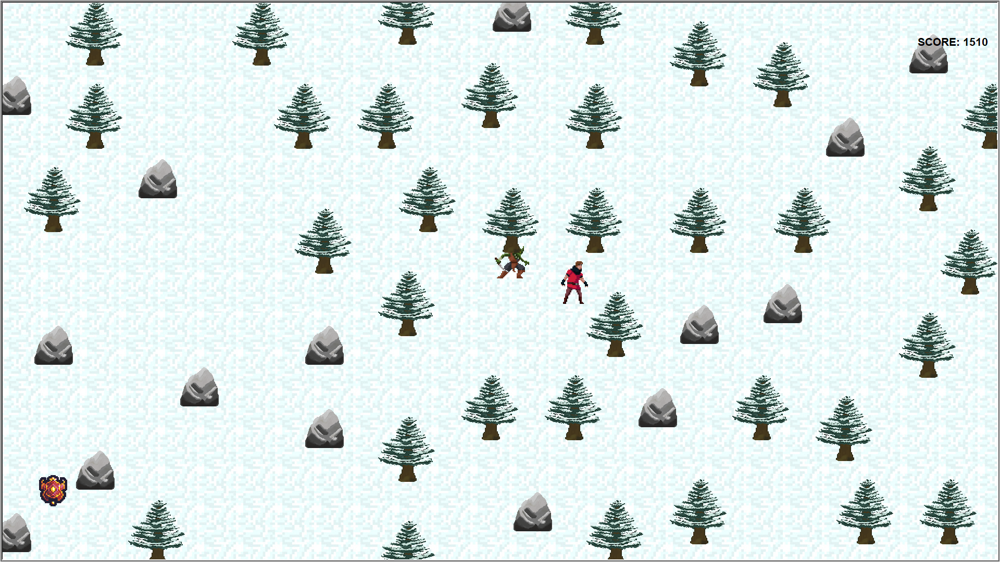
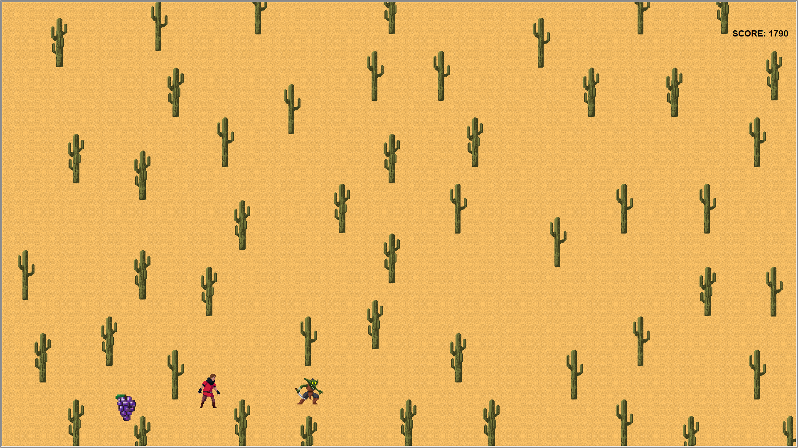
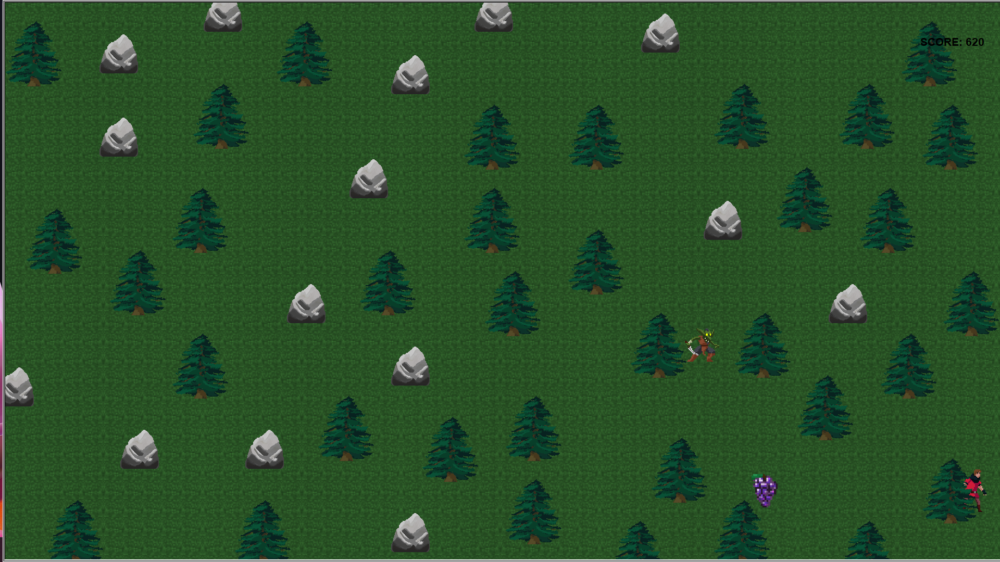

#  Maze Runner 2D

Originally created as a surprise birthday game for a friend, **Maze Runner 2D** has since evolved into a quirky little Python-based adventure. Built with Turtle Graphics, it's a light arcade-style game where you dodge obstacles, grab power-ups, and stay one step ahead of a relentless monster.

##  Gameplay

- You control a character trying to survive and escape a chaser.
- The "maze" is randomly generated — trees, cacti, and rocks block your path.
- One-time power-ups appear on each map:
  -  **Shield** – Blocks one hit and allows you to run away from the monster
  -  **Speed Boost** – Temporary movement speed increase.
- Reach the edge of the screen to generate a brand-new map, complete with:
  - Randomized terrain
  - A new layout
  - Fresh power-up spawn (one of each per map)

### Features

-  **Procedural Map Generation** with 3 biome variations  
-  **Simple AI Behavior** – A monster chases you intelligently  
-  **Power-Ups** – One-time collectibles per map  
-  **Obstacle System** – Varying types of map blockers  
-  **Replayability** – Every session is different  
-  **Fully Commented Python Code** – Easy to modify or expand  

##  Visual Assets

All visual assets belong to the following creators and are used under their respective standard free licenses (for personal use):

-  [ToffeeCraft - Forest/Nature Pack](https://toffeecraft.itch.io/forest-nature-pack)  
-  [LuizMelo - Monsters & Creatures Fantasy](https://luizmelo.itch.io/monsters-creatures-fantasy)  
- [SnoopethDuckDuck - Things Pack](https://snoopethduckduck.itch.io/things)

##  Screenshots






##  Getting Started

### Requirements

- Python 3.x  
- No external libraries (uses built-in Turtle module)

### How to Run

1. Clone the repo:
   ```bash
   git clone https://github.com/cosminelulul/maze-escape-game.git
   cd maze-escape-game
